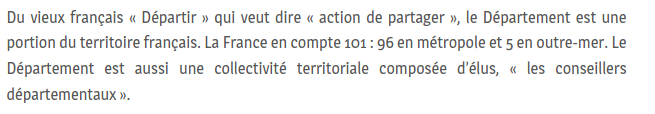

Justifier ou ne pas justifier ? Telle est la question.

## Ce que j'ai fait :
- lire l'article <a href="http://typographisme.net/post/La-justification-sur-le-web-:-usages-et-pr%C3%A9cautions">La justification sur le web : usages et précautions</a> du site Typographisme
- lire l'article <a href="https://www.fabricecourt.com/formation/doit-on-justifier-un-texte-sur-le-web/">Doit-on justifier le texte sur un site internet ?</a> par Fabrice Court

## Ce que j'ai appris
Je partais sur cet article avec un gros à priori car cela fait des années que je répète autour de moi, et particulièrement aux designers, "Ne justifiez pas votre texte, surtout pas&nbsp;!". Force est de constater que j'ai désormais un avis plus nuancé sur la question. Je vous explique en détails pourquoi.

### Justification de texte, esthétique et accessibilité
L'un des principaux problèmes soulevés par la justification du texte sur le web, c'est **l'apparition d'espacements importants et irréguliers entre les mots**. En effet sur le web, contrairement à l'imprimé, nous disposons de très peu de paramètres pour ajuster l'espacement. En l'occurrence `text-align: justify;` gère uniquement l'espace entre chaque mot (de sorte qu'une ligne occupe toute la largeur du bloc) et `letter-spacing` fixe au global l'espacement entre les caractères d'un mot.

<figure role="group">

<figcaption>Exemple de texte justifié présentant de nombreux espacements.</figcaption>
</figure>

**Outre un aspect esthétique dérangeant, la justification du texte peut entraîner des difficultés de lecture**, en particulier pour les personnes dyslexiques ou souffrant de troubles cognitifs. Contrairement à l'imprimé, le cadre du web est changeant - du fait de la diversité des tailles d'écran, des sytèmes d'exploitation, des navigateurs - et sans cesse en mouvement - on peut faire défiler une page horizontalement et verticalement -. Sur une lecture papier, nous pouvons poser notre doigt comme repère, sur l'écran il n'existe pas de repère immuable. Un texte aligné à gauche permet d'accrocher le regard sur les différents points d'aspérité des lignes, contrairement au texte justifié où plus aucun repère ne se dégage.

Pour autant, la justification de texte n'est pas expressément interdite en accessibilité.

### La justification du texte dans les textes de référence
Si l'on s'en tient au cadre purement normatif des standards d'accessibilité, la justification de texte n'est pas recommandée mais est néanmoins tolérée à certaines conditions.

Le <a href="https://references.modernisation.gouv.fr/rgaa-accessibilite/criteres.html#crit-10-9">critère 10.9 du Référentiel Général d'Amélioration de l'Accessibilité (RGAA) version 3</a> énonce ceci :

> Pour chaque page web, le texte ne doit pas être justifié. Cette règle est-elle respectée ?

Afin de valider ce critère, une des conditions suivantes doit être vérifiée :
  - Le texte n'est pas justifié.
  - Un mécanisme permet à l'utilisateur de supprimer la justification du texte.

**On peut donc justifier le texte, à condition de proposer aux utilisateurs et utilisatrices un mécanisme d'adaptation**. Le mécanisme en question peut, par exemple, être **un commutateur de styles**, sur le même principe que l'adaptation des couleurs et des contrastes.

**Le RGAA 4 ne fait désormais plus référence à la justification du texte** car il s'agit d'un critère de niveau AAA (le RGAA 4 se réfère désormais uniquement aux critères de niveau A et AA). **La justification du texte n'est donc pas un manquement à la conformité du RGAA**.

Les Web Content Accessibility Guidelines (WCAG) 2.1 quant à elles, recommandent également de ne pas justifier le texte et si tel est le cas, de <a href="https://www.w3.org/WAI/WCAG21/Techniques/general/G172" hreflang="en">fournir un mécanisme permettant son annulation</a>.

**La justification de texte n'est donc pas interdite en accessibilité**, si tant est que les utilisateurs et utilisatrices disposent d'un moyen pour annuler cette justification. La règle actuellement privilégiée est d'interdire la justification du texte afin d'éviter les plus gros écueils. C'est la recommandation donnée par AcceDe Web dans sa notice <a href="https://www.accede-web.com/notices/graphique/2-textes-symboles/2-2-ne-pas-justifier-texte/">Ne pas justifier le texte</a>. Toutefois, cette position peut être nuancée.  

### Justifier avec sagesse et prudence
Dans cet article <a href="http://typographisme.net/post/La-justification-sur-le-web-:-usages-et-pr%C3%A9cautions">La justification sur le web : usages et précautions</a>, l'auteur écrit ainsi :

> Sur ce site, le texte est justifié parce que j’ai essayé pour voir et que j’ai été toute étonnée de voir que ça marchait. [...] Le résultat n’est pas parfait, mais nous avons jugé que nous préférions les imperfections de la justification au déséquilibre de la composition en drapeau, dans la mesure où les imperfections ne nous semblaient pas faire obstacle à la lisibilité du texte. C’est une affaire de choix, de priorité et de bon sens.

**La justification d'un texte en ligne est possible, à condition de bien en comprendre les risques et de s'y connaître suffisamment pour résoudre les éventuels problèmes**. Le site <a href="http://typographisme.net/">Typographisme.net</a> revendique le choix de la justification et l'applique à tous ses articles. Je suis quelqu'un de plutôt allergique au texte justifié, pourtant cela ne m'a absolument pas dérangé sur ce site, je ne l'avais d'ailleurs pas vraiment remarqué.

Si ce choix est fait, plusieurs éléments doivent être pris en compte afin de garantir le meilleur confort de lecture possible :
- un choix de police adapté
- un bloc suffisamment large (autour de 60 caractères en français)
- une couleur de texte qui diminue le contraste avec l’arrière-plan
- des scripts javascript ou des propriétés CSS permettant de gérer automatiquement la césure, dans le respect de la langue du texte

Le site Typographisme ne propose cependant pas de mécanisme permettant de supprimer la justification, ce que je trouve à mon sens dommage car certes je n'ai eu aucun problème à la lecture, mais en tant que professionels et professionelles du web, nous nous devons de penser nos sites pour le plus grand nombre de personnes : d'autres internautes éprouveront peut être des difficultés à lire ces articles.

### Conclusion
Je reste convaincue que la justification de texte est à éviter sur le web pour des questions de lisibilité et de confort de lecture. Cependant, j'aurais appris qu'accessibilité et justification de texte ne sont pas nécessairement incompatibles et que l'on peut justifier du texte sur un site à condition de respecter certains conditions :
- proposer un mécanisme d'adaptation afin de contenter tous les utilisateurs et toutes les utilisatrices

- avoir une bonne connaissance des règles typographiques pour faciliter au maximum la lecture. 