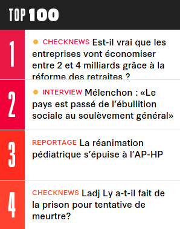
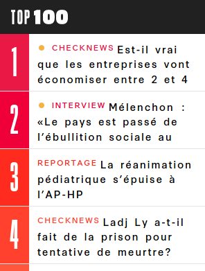

Comment laisser à l'internaute la possibilité d'adapter le texte selon ses besoins ?

## Ce que j'ai fait :
- lire l'article <a href="https://a11y-guidelines.orange.com/web/inc-con-aerer-texte.html">Permettre d'aérer le texte</a> d'Orange
- lire l'article <a href="https://www.w3.org/WAI/WCAG21/Understanding/text-spacing.html">Understanding Success Criterion 1.4.12: Text Spacing</a> des WCAG (<span lang="en">Web Content Accessibility Guidelines</span>)

## Ce que j'ai appris
### Un nouveau critère des WCAG
Ce critère d'adaptation du texte a fait son apparition dans les WCAG 2.1 et la version 4 du RGAA (Référentiel Général d'Amélioration de l'Accessibilité). Ce critère est le suivant :

> Dans chaque page web, les propriétés d’espacement du texte peuvent-elles être redéfinies par l’utilisateur sans perte de contenu ou de fonctionnalité (hors cas particuliers) ?

Concrètement, il s'agit de **permettre à l'internaute de personnaliser l'affichage du contenu pour améliorer son confort de lecture sans perte d'information**.

Ce critère est important pour les personnes malvoyantes et les personnes souffrant de dyslexie qui ont besoin d'agrandir l'espace entre les paragraphes, les mots et les lettres pour faciliter leur lecture.

### Mise en oeuvre
L'utilisateur ou l'utilisatrice doit être en mesure d'appliquer les modifications suivantes sans que le contenu ne soit tronqué ou se superpose à un autre contenu :
- l’espacement entre les lignes (`line-height`) doit pouvoir être augmenté à 1,5 fois minimum la taille de la police

- l’espacement entre chaque paragraphe (`<p>`) doit pouvoir être augmenté à 2 fois minimum la taille de la police

- l’espacement des lettres (`letter-spacing`) doit pouvoir être augmenté à 0,12 fois minimum la taille de la police

- l’espacement des mots (`word-spacing`) doit pouvoir être augmenté à 0,16 fois minimum la taille de la police

Ces tests reviennent dont à appliquer les styles suivants :

```
* {
    line-height: 1.5 !important;
    letter-spacing: .12em !important;
    word-spacing: .16em !important;
}

p {
    margin-bottom: 2em !important;
}
```

Notez que **les valeurs des tests sont bien des valeurs minimales à appliquer**. Les WCAG sont plutôt claires sur ce sujet puisqu'elles énoncent :
> <span lang="en">&nbsp;Line height (line spacing) to at least 1.5 times the font size</span>.

L'emploi du terme "<span lang="en">at least</span>" traduit par "au moins" ne laisse pas de doute, tandis que le RGAA formule le test de la façon suivante&nbsp;:
> L’espacement entre les lignes (line-height) est augmenté jusqu’à 1,5 fois la taille de la police.

Le terme "jusqu'à" peut, à mon sens, porter à confusion.

Les sous-titres directement intégrés dans une vidéo, les images-texte et les textes contenus dans une balise `<canvas>` ne sont pas concernés par ce critère.

### Le bookmarklet "<span lang="en">Text spacing</span>" pour faciliter les tests
Vous pouvez utiliser **le bookmarklet de Steve Faulkner** que vous pouvez retrouver sur Codepen&nbsp;: <a href="https://codepen.io/stevef/pen/YLMqbo" lang="en" hreflang="en">Text spacing bookmarklet</a>.

A titre indicatif, et pour celles et ceux comme moi qui l'ignoraient, un bookmarklet (ou signapplet en français) est un petit programme Javascript qui peut être stocké en tant qu'URL dans un signet ou en tant qu'hyperlien dans une page web.

Le bookmarklet de Steve Faulkner permet de vérifier la bonne implémentation de ce critère d'accessibilité : il applique les styles CSS (Cascading Style Sheets) vus précédemment à la page courante du navigateur vous permettant ainsi facilement de vérifier qu'il n'y a pas de perte de contenu ou de fonctionnalité.

<figure role="group">

<figcaption>Capture d'écran du site Libération avant utilisation du bookmarklet : on voit le texte déjà légèrement tronqué sur le premier item, sans doute à cause de la hauteur fixe de l'élément.</figcaption>
</figure>

<figure role="group">

<figcaption>Capture d'écran du site Libération après utilisation du bookmarklet : cette fois presque tous les items sont tronqués.</figcaption>
</figure>

### Vers une adaptation encore plus poussée ?
On pourrait pousser ce critère encore plus loin en intégrant également la possibilité pour l'internaute de changer la police de caractères, sa couleur ou la couleur d'arrière plan sans perte d'information. Ces possibilités de personnalisation sont en cours de discussion au sein du W3C (World Wide Web Consortium).

Acutellement la mise en place de commutateurs de styles peut permettre à l'internaute d'accentuer les contrastes ou de les inverser, de changer la police (pour une police plus adaptées aux personnes dyslexiques par exemple), d'adapter les couleurs pour les personnes souffrant de daltonisme... Cependant, intégrer ces commutateurs dans les sites représente un travail non négligeable et ne permet pas de couvrir les besoins de tous et toutes.

**Laisser les utilisateurs et utilisatrices adapter les contenus comme ils et elles le désirent, tout en leur garantissant un accès égal et non déterioré à l'information, me paraît donc être essentiel**.  


