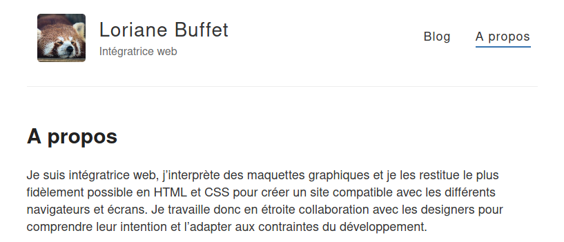

Des indications données par la forme, la taille ou la position sont-elle suffisantes ?

## Ce que j'ai fait :
- lire l'article <a href="https://disic.github.io/guide-integrateur/10-infos-forme-couleur.html#informationforme">Informations par la forme, taille ou position</a> du Guide de l'intégrateur
- lire l'article <a href="https://www.w3.org/WAI/WCAG21/Understanding/sensory-characteristics.html" lang="en" hreflang="en">Understanding Success Criterion 1.3.3: Sensory Characteristics</a> des WCAG (<span lang="en">Web Content Accessibility Guidelines</span>)
- lire la notice <a href="https://www.accede-web.com/notices/html-css-javascript/10-css/10-3-comprehension-information-css-desactive/">Garantir la compréhension de l’information même lorsque CSS est désactivé</a> d'AcceDe Web
- le chapitre "Ne pas donner l'information uniquement par la forme, la taille ou la position", du livre "Accessibilité web: Normes et bonnes pratiques pour des sites plus accessibles" d'Armony Altinier

## Ce que j'ai appris
### Analyse du critère
Dans un précédent article intitulé <a href="/100daysofa11y-day39/">Information et couleurs</a>, nous avons vu que l'information ne devait pas être donnée uniquement par la couleur. Les critères 10.9 et 10.10 du RGAA (Référentiel Général d'Amélioration de l'Accessibilité) s'intéressent cette fois à **l'information transmise par la forme, la taille ou la position**.

> Critère 10.9. Dans chaque page web, l’information ne doit pas être donnée uniquement par la forme, taille ou position. Cette règle est-elle respectée ?

> Critère 10.10. Dans chaque page web, l’information ne doit pas être donnée par la forme, taille ou position uniquement. Cette règle est-elle implémentée de façon pertinente ?

Ces critères s'appliquent aux textes et images, ainsi qu'aux <a href="https://www.numerique.gouv.fr/publications/rgaa-accessibilite/methode/glossaire/#media-non-temporel">médias non temporels</a> et <a href="https://www.numerique.gouv.fr/publications/rgaa-accessibilite/methode/glossaire/#media-temporel-type-son-video-et-synchronise">médias temporels</a>.

**Les personnes aveugles ou malvoyantes peuvent en effet être dans l'incapacité de comprendre une information si elle est véhiculée uniquement par sa forme, sa taille ou sa position**. En effet, en raison du principe du web qui vise à séparer le style du contenu, des indications du type "bouton carré" ou "bouton situé à droite" ne sont pas perceptibles par des utilisateurs ou utilisatrices dont les technologies d'assistance analysent uniquement le contenu.

**En revanche, ce type d'indication peut être efficace pour d'autres utilisateurs, notamment les personnes ayant des déficits cognitifs**.

Dans ces deux critères, c'est le mot "uniquement" qui donne tout son sens à la recommandation. En d'autre terme, **il ne s'agit pas d'interdire formellement les indications données par la forme, la taille et la position, mais de les doter d'alternatives pertinentes pour permettre à tous d'y accéder**. Par pertinentes, on entend notamment le fait que la couleur ne doit pas être la seule alternative proposée, les utilisateurs aveugles ne voyant ni forme ni couleur.

### Une grande variété de cas
Au cours de mes recherches sur cet article, j'ai eu énormément de mal à dégager des exemples types pour illustrer ces critères d'accessibilité. Ils concernent en effet des situations très différentes :
- une instruction du type "Cliquez sur l'icône carré pour continuer" (indication donnée par la forme)

- un nuage de tags où le score de pertinence est signalé par la taille des caractères (indication donnée par la taille)

- la présence d’un marqueur visuel, pour indiquer la page active dans un menu de navigation (indication donnée par la position)

- sur un site e-commerce une icône "X" seule pour signaler qu'un produit est actuellement en rupture de stock (indication donnée par la forme)

#### Un exemple : la position courante dans un système de navigation
Prenons l'exemple de ce blog. La position courante est indiquée graphiquement dans le menu par une bordure bleu.

<figure role="group">
  
  <figcaption>Capture d'écran du présent blog montrant le haut de la page "A propos", composée de l'image et du titre du blog, de la navigation et du début de contenu de la page. L'état actif de l'item "A propos" est signalé par une bordure bleu.</figcaption>
</figure>

Cette bordure bleu signale que l'onglet est actif. Cela permet donc de se situer dans l'arborescence du site et donc fournit une information capitale à l'internaute. Le code généré correspondant à ce menu est le suivant :

```
<nav class="header__nav" role="navigation">
  <ul class="main-nav">
    <li class="main-nav__item">
      <a class="main-nav__link" href="/">Blog</a>
    </li>

    <li class="main-nav__item main-nav__item--active">
      <a class="main-nav__link" href="/about" title="A propos, page active">A propos</a>
    </li>
  </ul>
</nav>
```

Outre la bordure bleu, l'indication de la page active est également signalé par l'attribut `title="A propos, page active"`. Le critère est donc bien valide car l'alternative est fournie via l'attribut `title` (dont la restitution n'est certes pas optimale comme nous l'avons déjà vu dans plusieurs articles précédents : une alternative possible serait l'utilisation de l'attribut `aria-current`, comme préconisé par la notice AcceDe Web <a href="https://www.accede-web.com/notices/html-css-javascript/1-structure/1-7-identifier-position-courante-navigation-aria-current/">Identifier la position courante dans les systèmes de navigation avec aria-current</a>)

On notera que si l'indication alternative avait été donnée uniquement par un changement de couleur de l'intitulé "A propos", cela n'aurait pas été suffisant.

D'autres alternatives sont possibles :
- désactiver le lien de la page courante en supprimant la balise `<a>` autour de l'intitulé

- intégrer l'intitulé de la page courante dans une balise `<strong>`

- proposer la restitution de l'information d'une autre façon, par exemple grâce à un fil d'Ariane. Certes l'information ne se situera pas au niveau même de l'onglet actif, mais cela permettra tout de même à l'utilisateur de bien savoir où il se situe.

Et vous, avez-vous des exemples de menus accessibles ?