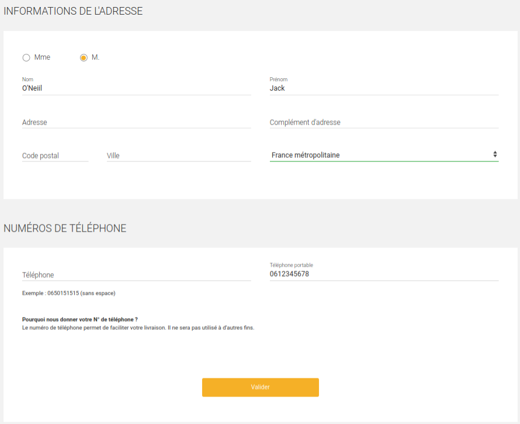

Construire des formulaires accessibles en structurant correctement les informations.

## Ce que j'ai fait :
- lire l'article <a href="https://disic.github.io/guide-integrateur/6-formulaires.html">Formulaires</a> du Guide de l'intégrateur
- lire l'article <a href="https://disic.github.io/guide-concepteur/3-formulaires.html">Formulaires</a> du Guide du concepteur
- lire l'article <a href="https://a11y-guidelines.orange.com/web/inc-dev-etiquette-formulaires.html">Rendre accessible les champs de formulaire</a> d'Orange
- lire la notice <a href="https://www.accede-web.com/notices/html-css-javascript/7-formulaires/7-9-identifier-letape-courante-des-formulaires-a-etapes-multiples-avec-aria-currentstep/">Identifier l’étape courante des formulaires à étapes multiples avec aria-current="step"</a> d'AcceDe Web

## Ce que j'ai appris
Structurer l'information permet d'avoir une meilleure compréhension du formulaire et donc de le remplir plus facilement.

### Regrouper les champs de même nature
Il s'agit ici de se conformer aux critères 11.5, 11.6 et 11.7 du RGAA (Référentiel Général d'Amélioration de l'Accessibilité) :

> Critère 11.5. Dans chaque formulaire, les champs de même nature sont-ils regroupés, si nécessaire ?

> Critère 11.6. Dans chaque formulaire, chaque regroupement de champs de formulaire a-t-il une légende ?

> Critère 11.7. Dans chaque formulaire, chaque légende associée à un regroupement de champs de même nature est-elle pertinente ?

**Par "champs de même nature", on entend les champs du même type, par exemple une liste de boutons radio ou de cases à cocher, ou des groupes de champs possédant des intitulés identiques**.

Par exemple, dans un formulaire d'achat en ligne, il est demandé de renseigner une adresse de livraison et une adresse de facturation. Ces deux adresses possèdent des champs avec des intitulés similaires (nom, prénom, numéro de rue, code postal, ville...), il est donc nécessaire de regrouper chacun de ces champs afin que l'internaute comprenne bien quelle adresse il ou elle est en train de remplir.  

En revanche, si un formulaire est relativement long mais que les champs ne possèdent pas d'intitulés identiques, il suffit de structurer le formulaire avec des balises `<h1>` à `<h6>`.

<figure role="group">
  
  <figcaption>Capture d'écran d'un formulaire structuré en plusieurs parties (Informations de l'adresse et Numéros de téléphone). Ces différentes parties sont structurées à l'aide de titres car il ne s'agit pas d'informations de même type ou de même nature.</figcaption>
</figure>

#### Regrouper avec les balises `<fieldset>` et `<legend>`
Les champs doivent être regroupés à l'aide des balises `<fieldset>` et `<legend>`. Si nous reprenons l'exemple des adresses de livraison et facturation, cela donne :

```
<fieldset>
  <legend>Adresse de livraison</legend>

  <label for="prenom-1">Prénom</label>
  <input type="text" id="prenom-1" />

  <label for="nom-1">Nom</label>
  <input type="text" id="nom-1" />

  <label for="rue-1">Rue</label>
  <input type="text" id="rue-1" />
  [...]
</fieldset>

<fieldset>
  <legend>Adresse de facturation</legend>

  <label for="prenom-2">Prénom</label>
  <input type="text" id="prenom-2" />

  <label for="nom-2">Nom</label>
  <input type="text" id="nom-2" />

  <label for="rue-2">Rue</label>
  <input type="text" id="rue-2" />
  [...]
</fieldset>
```

Voici également un exemple avec une liste de boutons radio :

```
<fieldset>
  <legend>Quel est votre moyen de déplacement quotidien ?</legend>

  <input type="radio" id="velo"/>
  <label for="velo"/>Le vélo</label>

  <input type="radio" id="commun"/>
  <label for="commun"/>Les transports en commun</label>

  <input type="radio" id="marche"/>
  <label for="marche"/>La marche à pied</label>
</fieldset>
```

#### Les autres formes de regroupement
**Il est également possible de regrouper les champs de même nature dans une balise possédant un `role="group"`**. Dans l'exemple suivant, l'élément `<div>` a un `role="group"` qui permet de regrouper les champs de même nature et l'attribut `aria-labelledby` associé à son `id` correspondant désigne l'intitulé du groupe de champs :

```
<div role="group" aria-labelledby="livraison-entete">
  <div id="livraison-entete">Adresse de livraison :</div>

  <div>
    <label for="livraison-nom">Nom</label>
    <input type="text" name="livraison-nom" id="livraison-nom">
  </div>
  [...]
</div>
<div role="group" aria-labelledby="facturation-entete">
  <div id="facturation-entete">Adresse de facturation</div>

  <div>
    <label for="facturation-nom">Nom</label>
    <input type="text" name="facturation-nom" id="facturation-nom">
  </div>
  [...]
</div>
```

Pour les listes de boutons radio, il est également possible d'utiliser `role="radiogroup"`, combiné avec l'attribut `aria-labelledby` et son `id` correspondant. Par exemple :

```
<p id="question">Quel est votre moyen de déplacement quotidien ?</p>

<div role="radiogroup" aria-labelledby="question">
  <input type="radio" id="velo"/>
  <label for="velo"/>Le vélo</label>

  <input type="radio" id="commun"/>
  <label for="commun"/>Les transports en commun</label>

  <input type="radio" id="marche"/>
  <label for="marche"/>La marche à pied</label>
</div>
```

### Structurer les listes de choix
Le RGAA énonce le critère suivant :

> Critère 11.8. Dans chaque formulaire, les items de même nature d’une liste de choix sont-ils regroupées de manière pertinente ?

Les listes de choix, appelées aussi listes déroulantes et désignées par l'attribut `<select>`, doivent être structurées : **lorsque c'est nécessaire, de la même manière que pour les champs, les items de même nature doivent être regroupés**. C'est la balise `<optgroup>` pourvue d'un attribut `label` qui doit être employée pour constituer ces groupes d'items. Par exemple :

```
<label for="categorie">Catégories de transports</label>
<select id="categorie">
  <optgroup label="Transports en commun">
    <option>Bus</option>
    <option>Métro</option>
    <option>Covoiturage</option>
  </optgroup>

  <optgroup label="Transports individuels">
    <option>Vélo</option>
    <option>Voiture</option>
    <option>Moto</option>
  </optgroup>
<select>
```

Pour une liste de choix courte, il n'est pas nécessaire de regrouper les items. Néanmoins, il est conseillé de les présenter dans un ordre logique afin de faciliter le choix de l'internaute. Par exemple : un ordre alphabétique pour une liste de pays ou un ordre numérique pour une liste de départements.

### Les étapes d'un formulaire
Le RGAA version 4 ne donne pas d'indications concernant les étapes d'un formulaire, néanmoins Opquast recommande quelques bonnes pratiques à ce sujet que je trouve assez pertinentes et qui concourent à aider l'internaute :
- <a href="https://checklists.opquast.com/fr/qualiteweb/les-processus-complexes-sont-accompagnes-de-la-liste-de-leurs-etapes">Les processus complexes sont accompagnés de la liste de leurs étapes</a>

- <a href="https://checklists.opquast.com/fr/qualiteweb/letape-en-cours-dun-processus-complexe-est-indiquee">L'étape en cours d'un processus complexe est indiquée</a>

- <a href="https://checklists.opquast.com/fr/qualiteweb/chaque-etape-dun-processus-complexe-permet-de-revenir-a-letape-precedente">Chaque étape d'un processus complexe permet de revenir à l'étape précédente</a>

Il s'agit d'informer l'internaute sur les actions qu'il s'apprête réaliser, notamment la durée nécessaire pour compléter le formulaire dans son intégralité. Il est donc recommandé d'indiquer la liste des différentes étapes d'un formulaire et de préciser l'étape en cours. Il est également important de permettre à l'internaute de revenir en arrière sur les précédentes étapes, grâce à un bouton de navigation par exemple.

L'étape courante peut être indiquée avec la propriété `aria-current="step"`. Par exemple :

```
<nav aria-label="Étapes de votre demande d'information">
   <ol>
      <li><a href="../infos.html">Informations personnelles</a></li>
      <li aria-current="step">Objet de la demande</li>
      <li>Récapitulatif</li>
   </ol>
</nav>
```