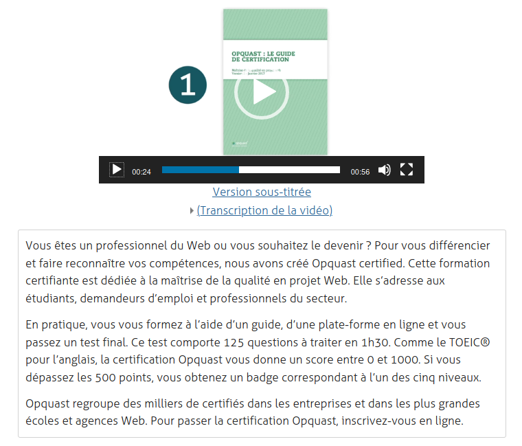

Beaucoup de vocabulaire et de définitions dans ce premier article concernant les médias accessibles.

## Ce que j'ai fait :
- lire l'article <a href="https://a11y-guidelines.orange.com/others/video-audio.html">Recommandations accessibilité des contenus vidéos, animations et audios</a> d'Orange
- lire l'article <a href="https://toscaconsultants.fr/accessibilite-numerique/referentiel-technique/multimedia">Multimédia</a> de Tosca Consultants
- lire l'article <a href="https://www.24joursdeweb.fr/2019/comment-bien-sous-titrer-les-videos/">Comment bien sous-titrer les vidéos ?</a> d'Emmanuelle Aboaf

## Ce que j'ai appris
### Typologie des médias
Le RGAA (Référentiel Général d'Amélioration de l'Accessibilité) distingue 2 types de médias :
- média temporel
- média non temporel

#### Média temporel
**Un média temporel est un média qui se déroule dans le temps**. Par exemple : une piste audio ou une vidéo.

Il est important de noter que les GIF (Graphics Interchange Format) animés et les animations d'images réalisées en Javascript ou CSS (Cascading Style Sheets) ne sont pas considérés comme des médias temporels.

Un média temporel peut être :
- **synchronisé** : c'est à dire contenir à la fois un flux audio et vidéo, ou des éléments interactifs comme des liens intégrés dans une vidéo
- **uniquement audio**
- **uniquement vidéo**

Un média temporel peut être **pré-enregistré** ou **diffusé en direct**.

Un média temporel peut être consulté de différentes manières :
- **sous forme d'un fichier à télécharger**
- **intégré directement dans la page** via les éléments `<audio>`, `<video>`, `<svg>` ou `<canvas>`
- intégré directement dans la page via un plugin Flash

#### Média non temporel
**Un média non temporel est un média qui ne se déroule pas dans le temps**. Par exemple&nbsp;: une carte interactive, un diaporama ou une application Flash.

**Un média non temporel peut contenir un média temporel**. Par exemple : un lecteur Flash permet de consulter une liste de vidéos.

### Les solutions techniques pour rendre un média accessibles
Il existe différents moyens de rendre un média accessible, en fonction de son type (temporel ou non, pré-enregistré ou en direct, synchronisé ou seulement audio/vidéo).

#### La transcription textuelle
Il s'agit de retranscrire sous forme de texte **l'intégralité d'un contenu audio et/ou vidéo**. L'internaute doit avoir accès à la totalité de ce qui est exprimé oralement ainsi qu'à toutes les informations importantes permettant de comprendre l'action en cours. Par exemple :
- les dialogues et commentaires
- la musique et les bruits environnants
- les lieux, les noms des personnes...

Cette retranscription peut être réalisée en code HTML (HyperText Markup Language) ou dans un fichier texte. Elle peut se trouver dans la même page ou être consultable via un lien, à proximité du média concerné.

<figure role="group">
  
  <figcaption>Capture d'écran d'une vidéo avec transcription textuelle : sur Opquast, il est possible d'accéder à la transcription en cliquant sur l'ancre située juste au-desous de la vidéo.</figcaption>
</figure>

#### Les sous-titres
**Les sous-titres doivent comprendre l'ensemble des contenus sonores (les dialogues mais aussi tout son porteur d'informations tel que le bruit, la musique...)**. Ils doivent être affichés de manière synchronisée avec le flux vidéo du média.

Les sous-titres ne doivent pas être incrustés directement dans la vidéo mais dans un fichier texte indépendant (généralement au format `srt`) qui peut ensuite être ajouté ou non à la vidéo.

Pour plus d'informations sur la manière de réaliser correctement des sous-titres accessibles, je vous invite à lire l'article d'Emmanuelle Aboaf, <a href="https://www.24joursdeweb.fr/2019/comment-bien-sous-titrer-les-videos/">Comment bien sous-titrer les vidéos ?</a> sur l'édition 2019 de 24 jours de web.

#### L'audiodescription
**Il s'agit d'un commentaire audio qui vient compléter la piste audio principale, afin de restituer des informations accessibles seulement par l'image**. Par exemple : le mouvement des acteurs ou des textes affichés à l'écran. Ainsi dans le cas d'une vidéo montrant une interview sans autre information visuelle, l'audiodescription n'est pas forcément pertinente.

L'audiodescription est généralement ajoutée pendant les pauses qui existent dans la piste audio principale. Quand il est nécessaire d'ajouter des périodes de pause supplémentaires, l'audiodescription est dite "étendue".

L'audiodescription ne doit pas être ajoutée directement dans la vidéo mais dans un fichier à part.

#### La version alternative audio seulement
Ce type d'alternative concerne les médias vidéo uniquement, qui ne contiennent pas d'information sonore. **La version alternative audio est une version sonore, sous forme de fichier MP3, et contient toutes les informations visuelles importantes de la vidéo**.  

#### La langue des signes
Certaines personnes sourdes et malentendantes ne lisent et ne comprennent que la langue des signes. C'est pourquoi une transcription textuelle ou des sous-titres ne sont pas toujours suffisants. Il peut donc être intéressant de rajouter une transcription en LSF (Langue des Signes Française) dans la vidéo, en incrustation ou sous la forme d'une vidéo indépendante.

J'évoquerai dans un prochain article quelle solution technique doit être appliquée a tel type de média.