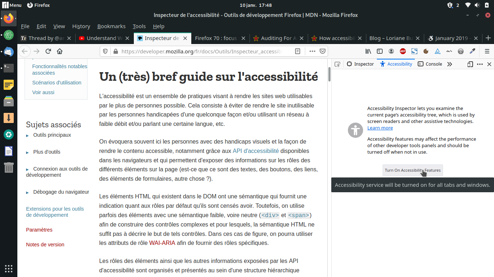
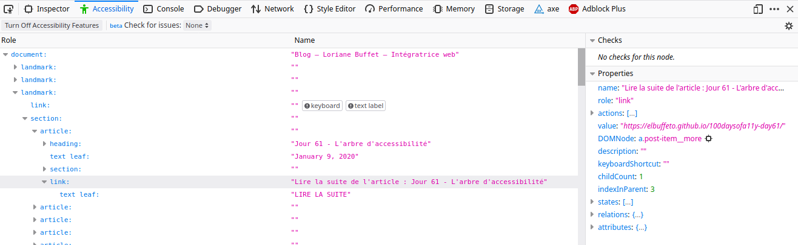
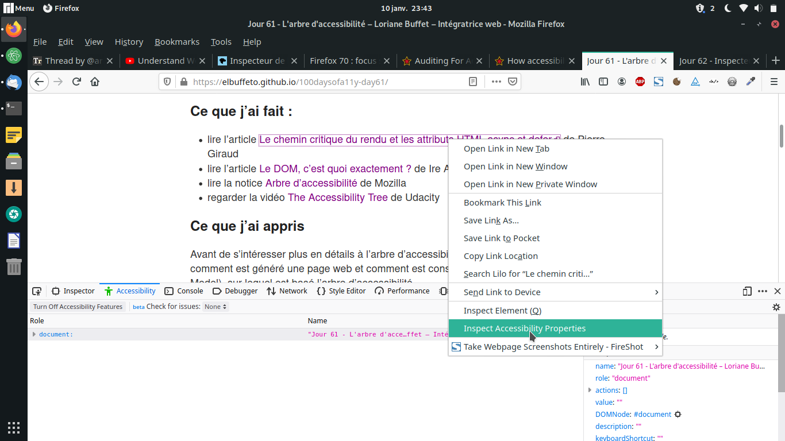
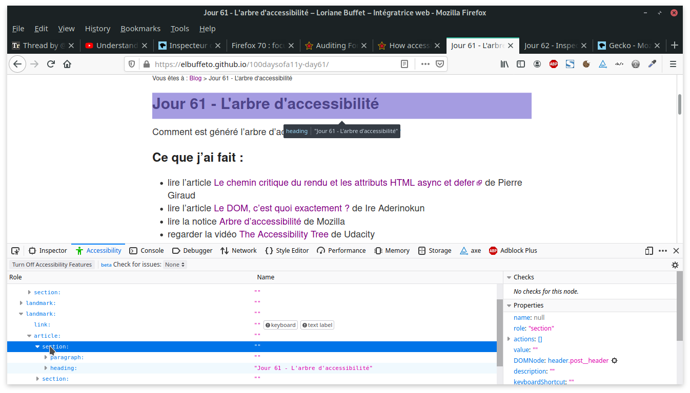
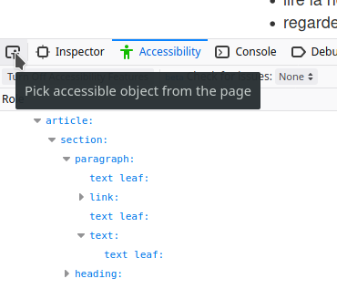
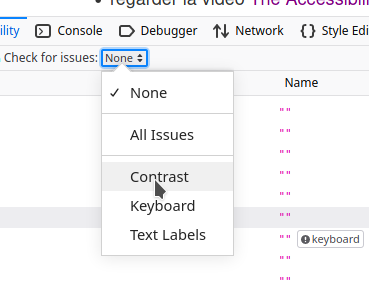

Comment inspecter l'arbre d'accessibilité dans Firefox ?

## Ce que j'ai fait :
- regarder la vidéo <a href="https://youtu.be/7mqqgIxX_NU" lang="en" hreflang="en">Understand Website Accessibility with the Firefox Accessibility Inspector</a> de Jen Simmons
- lire l'article <a href="https://developer.mozilla.org/fr/docs/Outils/Inspecteur_accessibilite">Inspecteur de l'accessibilité</a> de Mozilla
- lire l'article <a href="https://hacks.mozilla.org/2019/06/how-accessibility-trees-inform-assistive-tech/" lang="en" hreflang="en">How accessibility trees inform assistive tech</a> de Hidde de Vries
- lire l'article <a href="https://hacks.mozilla.org/2019/10/auditing-for-accessibility-problems-with-firefox-developer-tools/" lang="en" hreflang="en">Auditing For Accessibility Problems With Firefox Developer Toolse</a> de Marco Zehe
- inspecter mon blog et mon site personnel avec l'inspecteur d'accessibilité

## Ce que j'ai appris
### Activer l'inspecteur d'accessibilité de Firefox
L'inspecteur d'accessibilité est disponible dans les outils de développement depuis Firefox 63.

Par défaut, les outils de développement consacrés à l'accessibilité sont désactivés : le moteur d'accessibilité est en effet gourmand en énergie et peut réduire les performances du navigateur. Aussi, lorsque vous n'en avez plus l'utilité, pensez à l'éteindre.

C'est le bouton "Activer les fonctionnalités d'accessibilité" qui permet d'afficher le panneau d'accessibilité. L'icon en forme de bonhomme située à gauche dans l'onglet "Accessibilité" prend la couleur verte pour indiquer que l'inspecteur d'accessibilité est actif.

<figure role="group">
  
  <figcaption>Capture d'écran de l'inspecteur d'accessibilité de Firefox : par défaut il est inactif et peut être activé grâce au bouton "Activer les fonctionnalités d'accessibilité"</figcaption>
</figure>

### Le panneau d'accessibilité
#### Présentation
Le panneau d'accessibilité se découpe en deux parties :
- **l'arbre d'accessibilité** représentant de manière hiérarchique les différents éléments de la page courante. Les éléments qui possèdent des éléments fils disposent d'une flèche sur laquelle on peut cliquer pour accéder aux éléments inférieurs. Chaque objet est présenté dans l'arbre d'accessibilité avec son nom et son rôle.

- la seconde partie présente **des propriétés supplémentaires sur les éléments sélectionnés dans l'arbre**, telles que le nom et le rôle (déjà présents dans l'arbre), les actions qui peuvent être effectuées sur l'élément, la valeur de l'élément, les différents états... Vous pouvez retrouver l'ensemble des propriétés et leur explication sur l'article <a href="https://developer.mozilla.org/fr/docs/Outils/Inspecteur_accessibilite">Inspecteur de l'accessibilité</a> de Mozilla

<figure role="group">
  
  <figcaption>Capture d'écran du panneau d'accessibilité de Firefox : à gauche l'arbre d'accessibilité, à droite les différentes propriétés relatives aux éléments de l'arbre</figcaption>
</figure>

#### Prise en main
Lorsque l'inspecteur d'accessibilité est activé, **une option supplémentaire apparaît dans le menu contextuel de la page (menu accessible via le clic droit sur un élément) :  "Inspecter les propriétés d'accessibilité"**. Cette option ouvre automatiquement le panneau d'accessibilité (si ce n'est pas déjà fait) et se positionne directement sur l'élément dans l'arbre d'accessibilité.

<figure role="group">
  
  <figcaption>Capture d'écran du menu contextuel : l'option "Inspecter les propriétés d'accessibilité" permet de situer directement dans l'arbre d'accessibilité l'élément sélectionné.</figcaption>
</figure>

Dans le panneau d'accessibilité, lorsque la souris survole un élément de l'arbre, l'élément en question se démarque visuellement sur la page grâce à un surlignage semi-transparent. Son nom et son rôle sont également indiqués.

<figure role="group">
  
  <figcaption>Capture d'écran du survol d'un élément via le panneau d'accessibilité : l'élément est surligné, son nom et son rôle sont affichés en haut, au centre.</figcaption>
</figure>

**Il est également possible de sélectionner directement un élément dans la page et de le retrouver ensuite dans l'arbre d'accessibilité**. Le sélecteur d'accessibilité, lorsqu'il est activé, permet de survoler la page et de mettre en évidence les différents éléments grâce à un surlignage semi-transparent, ainsi que leur nom et leur rôle. On peut ensuite voir l'élément sélectionné dans l'arbre d'accessibilité du panneau.

<figure role="group">
  
  <figcaption>Capture d'écran du sélecteur d'accessibilité : lorsqu'il est actif, il permet de sélectionner les différents éléments de la page courante au survol.</figcaption>
</figure>

### Résoudre des problèmes d'accessibilité avec l'inspecteur
**L'inspecteur d'accessibilité nous indique tout d'abord quelles informations seront restituées aux personnes utilisant des technlogies d'assistance**. Cela nous permet donc, avant même d'utiliser des lecteurs d'écran, de disposer d'un premier test de lecture de notre code. Jen Simmons, dans sa vidéo <a href="https://youtu.be/7mqqgIxX_NU" lang="en" hreflang="en">Understand Website Accessibility with the Firefox Accessibility Inspector</a>, montre ainsi comment utiliser l'inspecteur et l'arbre d'accessibilité pour améliorer l'accessibilité de son code.

L'inspecteur d'accessibilité permet également de cibler des problèmes plus spécifiques :
- **les contrastes** : l’inspecteur peut vérifier le contraste de couleurs des différents éléments et indiquer s'il est conforme ou non aux règles des WCAG (Web Content Accessibility Guidelines).

- **les contrôles au clavier** : l'inspecteur détecte les problèmes courants liés à la navigation au clavier et donne des indications sur comment les résoudre.

- **la présence du nom de l'élément** : l'inspecteur vérifie que les différents éléments de l'arbre sont correctement nommés. Le nom est en effet la principale source d'information que les technologies d'assistance utilisent pour informer l'internaute sur ce que fait un élément particulier.  

- **le simulateur de déficience de perception des couleurs** : cette fonctionnalité est censé être présente depuis Firefox 70 cependant ce n'est pas mon cas (j'utilise Firefox version 70 sur Linux), peut-être avez-vous ce problème également ? Cet outil simule sept types de déficiences de perception des couleurs, ce qui permet d'avoir un aperçu de la manière dont les personnes souffrant d’un handicap visuel verraient la page.

<figure role="group">
  
  <figcaption>Capture d'écran du menu de détection des problèmes d'accessibilité : il est possible de sélectionner un problème à la fois, ou tous en même temps.</figcaption>
</figure>