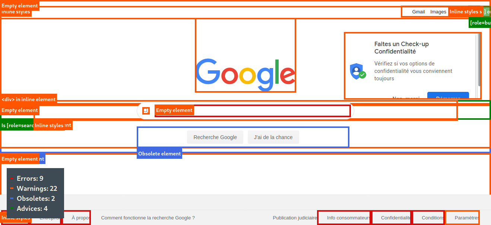

Prise en main de quelques outils de test : l'assistant RGAA et a11y.css.

## Ce que j'ai fait :
- installer <a href="https://addons.mozilla.org/fr/firefox/addon/assistant-rgaa/">l'extension Assistant RGAA pour Firefox</a>
- tester une dizaine de critères avec l'assistant RGAA sur la page <a href="https://developer.mozilla.org/fr/docs/Web/HTML">HTML (HyperText Markup Language)</a> de Mozilla
- installer <a href="https://addons.mozilla.org/fr/firefox/addon/a11ycss/">l'extension a11y.css pour Firefox</a>
- tester la <a href="https://www.google.com/">page d'accueil de Google</a>

## Ce que j'ai appris
### Assistant RGAA
#### Présentation
**L'extension assistant RGAA est un guide pour les personnes effectuant un audit accessibilité sur un site**. Il reprend la liste complète des critères et tests du référentiel RGAA et propose des fonctionnalités pour en vérifier la conformité. Selon le test, cette fonctionnalité peut-être automatique ou non.

A noter que cet outil se base actuellement sur <a href="https://references.modernisation.gouv.fr/rgaa-accessibilite/changelog.html">la version RGAA-3 2017</a>, et non pas la version RGAA 4.

Le principe est simple : pour chaque test, l'extension applique des modifications à la page courante (désactivation de feuilles de styles, mise en évidence des balises à évaluer...), permettant d'effectuer plus simplement les tests.

L'agence Empreinte Digitale explique en détails le fonctionnement de l'outil dans son article <a href="https://blog.empreintedigitale.fr/2019/05/02/publication-de-lassistant-rgaa-avec-le-referentiel-3-2017/">Publication de l’assistant RGAA avec le référentiel 3.2017</a>, et l'onglet "Aide" de l'extension donne des explications très claires et instructives.

#### Retour d'expérience
**J'ai bien aimé** :
- la navigation par thématique

- le fait de pouvoir placer le panneau d'extension où on veut dans le navigateur, voire même le mettre dans une nouvelle fenêtre

- le petit drapeau qu'on peut pencher pour indiquer que le test est fait

- les outils intégrés comme l'analyseur de contraste ou la hiérarchie de titres qui permet d'éviter la multiplication d'outils de tests

- la section "Description" d'un test qui fournir des explications sur ce que le script de test modifie dans la page

- les liens explicatifs vers le RGAA ou son glossaire

**J'ai moins aimé** :
- le fait que la section "Description" du test n'est pas évidente à trouver : elle n'apparaît que si on active le test et je ne l'avais pas vu tout de suite

- les éléments mis en évidence dans la page ne sautent pas forcément aux yeux et il faut chercher un peu pour les trouver, d'autant que comme les styles sont désactivés pour le test on perd les repères de la page

### A11y.css
#### Présentation
A l'origine une simple feuille de styles, a11y.css est désormais une extention web (et également un bookmarklet). Lors de la consulation d'un site, cette extension applique un ensemble de règles CSS permettant de débusquer des erreurs d'accessibilité et plus largement un mauvais code.

#### Retour d'expérience
J'ai testé la page d'accueil de Google : <a href="https://www.google.com/">https://www.google.com/</a>. Résultat :
- 9 erreurs
- 20 avertissements
- 2 éléments obsolètes
- 4 conseils

<figure role="group">
  
  <figcaption>Capture d'écran de la page Google testée avec l'extension a11y.css : énormément d'erreurs relevées pour une page comportant pourtant peu d'éléments.</figcaption>
</figure>

**J'ai bien aimé** :
- le concept même de l'extension : utiliser presque uniquement du CSS pour signaler des erreurs d'accessibilité, de qualité web et de bonnes pratiques

- la possibilité de personnaliser le niveau d'évaluation souhaitée

- la possibilité d'utiliser des outils pour aggrandir le texte ou forcer l'affichage du focus

- les erreurs sur la page sont bien mises en évidence et les styles ne sont pas désactivés ce qui permet de se repérer facilement

- <a href="https://ffoodd.github.io/a11y.css/" hreflang="en">la documentation très complète</a> (en anglais)

**J'ai moins aimé** :
- certains éléments sur la page sont mis en évidence mais il n'y a pas d'explication associée

- les éléments mis en évidence sur la page peuvent être amenés à se chevaucher ce qui rend la lecture de l'erreur difficile

- en fonction du niveau d'erreur sélectionnée, je n'ai pas obtenu le même nombre d'erreurs (parfois 10, parfois 9)